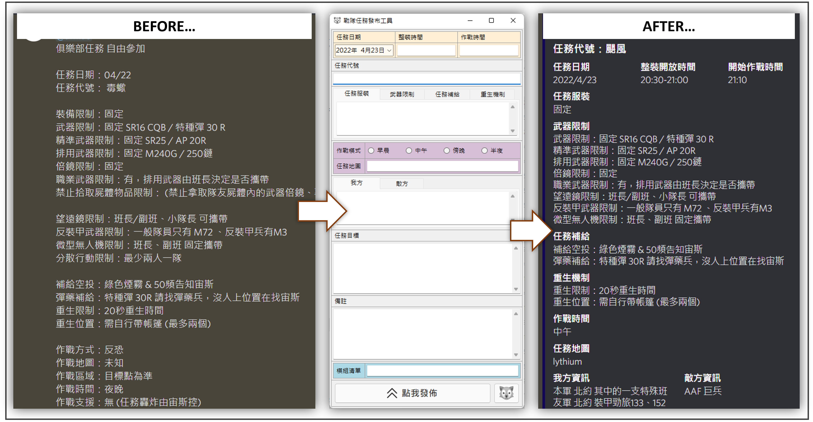
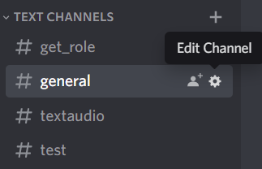
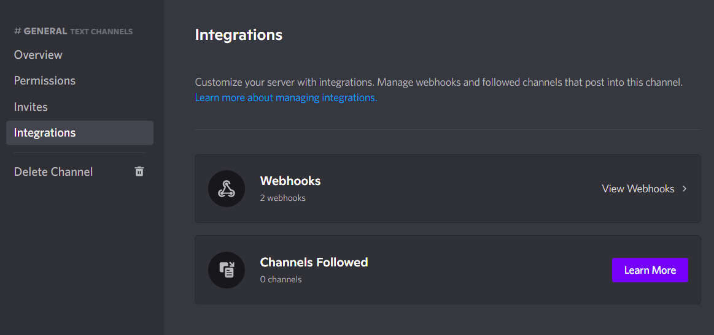
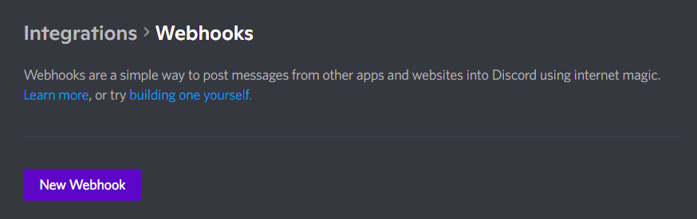
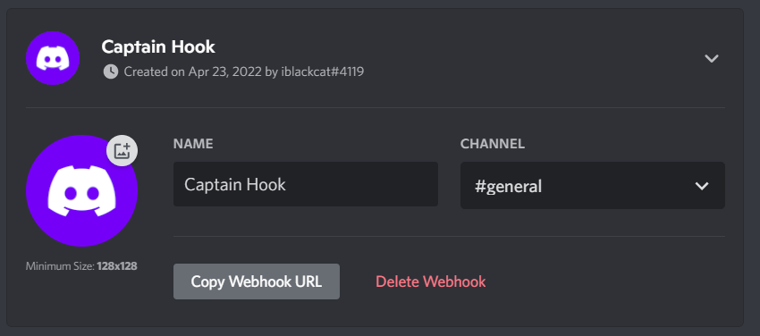

# DiscordMissionPubTool
Arma Discord 戰隊任務發佈工具<br>


---
## 使用教學
1. 點選頻道旁邊的齒輪，進入設定頁面。



2. 點選Intergrations(整合)。



3. 點選Webhooks並點選New Webhook 創建新的Webhooks。



4. 設定Webhooks的名稱還有所在頻道，完成後點選Copy Webhook URL(複製Webhook網址)。



複製的網址會像這樣子：<br>
```
https://discord.com/api/webhooks/<Webhook ID>/<Webhook Token>
```
5. 打開`DiscordMissionPubTool.exe.config`，根據下方表格及範例，填入對應的資訊：

| 欄位 | 用途 | 必填? |
|-----|------|------|
|DiscordWebhookID|WebHook ID，可在Webhook URL中找到。|Y|
|DiscordWebhookToken|Webhook 權杖(驗證碼)，可在Webhook URL中找到。|Y|
|DiscordTagRoleID|Discord 身分組ID|Y|
|ClanName|戰隊名稱。|Y|
|ClanColor|任務資訊側邊條顯示顏色。|Y|
|ClanPictureUrl|戰隊Logo圖片。|X|
```xml
<applicationSettings>
    <DiscordMissionPubTool.Properties.Settings>
        <setting name="DiscordWebhookID" serializeAs="String">
            <value>12345678912345678912</value>
        </setting>
        <setting name="ClanName" serializeAs="String">
            <value>黑貓戰術中隊</value>
        </setting>
        <setting name="ClanColor" serializeAs="String">
            <value>002054</value>
        </setting>
        <setting name="ClanPictureUrl" serializeAs="String">
            <value />
        </setting>
        <setting name="DiscordWebhookToken" serializeAs="String">
            <value>123456789123456789121234567891234567891212345678912345678912123456789</value>
        </setting>
        <setting name="DiscordTagRoleID" serializeAs="String">
            <value>12345678912345678912</value>
        </setting>
    </DiscordMissionPubTool.Properties.Settings>
</applicationSettings>
```
## 授權
本軟體以[啤酒軟體（Beerware）](https://en.wikipedia.org/wiki/Beerware)方式授權並釋出。
