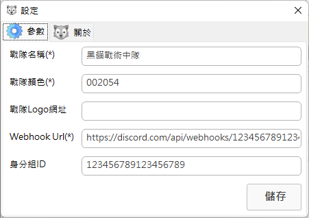

# DiscordMissionPubTool
Arma Discord 戰隊任務發佈工具 
[TOC]

---
# 使用教學
1. 點選頻道旁邊的齒輪，進入設定頁面。

2. 點選Intergrations(整合)。

3. 點選Webhooks並點選New Webhook 創建新的Webhooks。

4. 設定Webhooks的名稱還有所在頻道，完成後點選Copy Webhook URL(複製Webhook網址)。

5.點選設定按鈕，根據下方表格及範例，填入對應的資訊：

| 欄位 | 用途 | 必填? |
|-----|------|------|
|戰隊名稱|戰隊名稱。|Y|
|戰隊顏色|任務資訊側邊條顯示顏色。|Y|
|戰隊Logo網址|戰隊Logo圖片網址。|X|
|Webhook URL|Discord WebHook URL，直接複製貼上即可。|Y|
|身分組ID|Discord 身分組ID，可用','隔開|X|

# 授權
本軟體以[GPL-3.0 Licences](https://www.gnu.org/licenses/gpl-3.0.en.html)方式授權並釋出。

# 使用套件包
- [Taiizor/ReaLTaiizor](https://github.com/Taiizor/ReaLTaiizor)